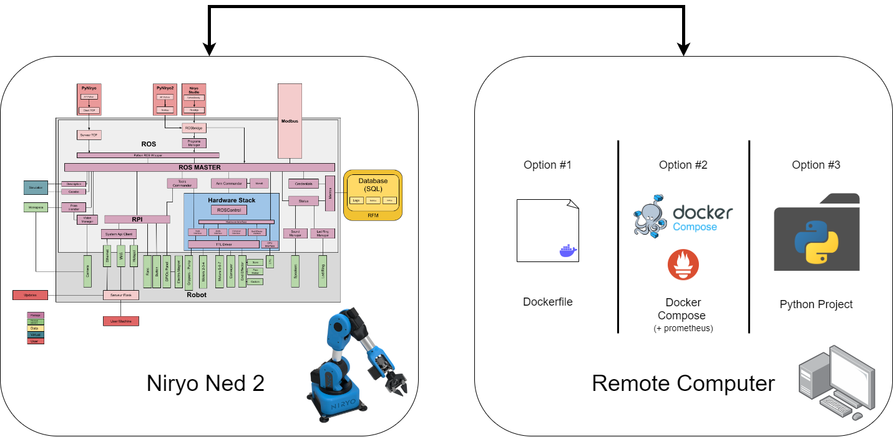

# Remote Control Niryo Ned 2

Repository for the Remote Control of Niryo Ned 2. 

## Niryo Ned 2

The Niryo Ned 2 is a robotic arm that runs on open-source software (https://github.com/NiryoRobotics/ned_ros). The code is designed based on ROS, where there are a number of different ROS nodes, each running a specific component of the robots hardware (there are also other support ROS nodes).

## How to use it?

The remote control of the robot is operated with the keys on your keyboard. When the code is launched there is a diagram clearly showing what keys correspond to what motors. 

The terminal will print the following lines of code;


To deploy this code there are three possible ways;

### 1. Use the Dockerfile

1.1 Generate the Dockerfile;

```docker build . -t remote_controller```

1.2 Launch the Docker Container;

```docker run -it remote_controller```

### 2. Use Docker Compose (will generate Prometheus Server)

2.1 Generate Docker Compose;

```docker compose build```

2.2 Run Docker Compose;

```docker compose up -d```

2.3 Attach to Niryo Ned 2 Docker Container;

```docker attach niryo-ned-2```


### 3. Launch Locally

3.1 Create Python Virtual Environment

```python -m venv .venv```

3.2 Source Virtual Environment

```source .venv/bin/activate```

3.3 Install Dependancies

```pip install -r requirements.txt```

3.4 Launch Python Project

```python main.py```

## Expected Results

A prometheus graph should be present in URL: http://http://172.27.13.150:9000/. With information regarding the time it has taken to move the arm.

## Diagram 


## Next Steps

- [ ] Add time taken in the shell
- [ ] Make the step be modifiable,  (-0.10 / +0.10) ->  (U / O).
- [x] Add Diagram in the remote shell